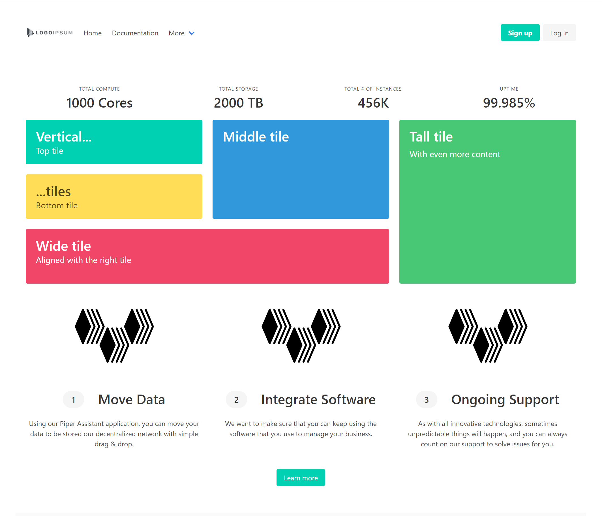

# Getting Started

This project was bootstrapped with [Create React App](https://github.com/facebook/create-react-app).

## Purpose

A starter project built using React v17 library with typescript, MobX for state management, and the Bulma CSS Framework.

## Get Started

Simply clone the project and run 'npm install' then 'npm start' and modify to your desired specifications.

## Screenshot

